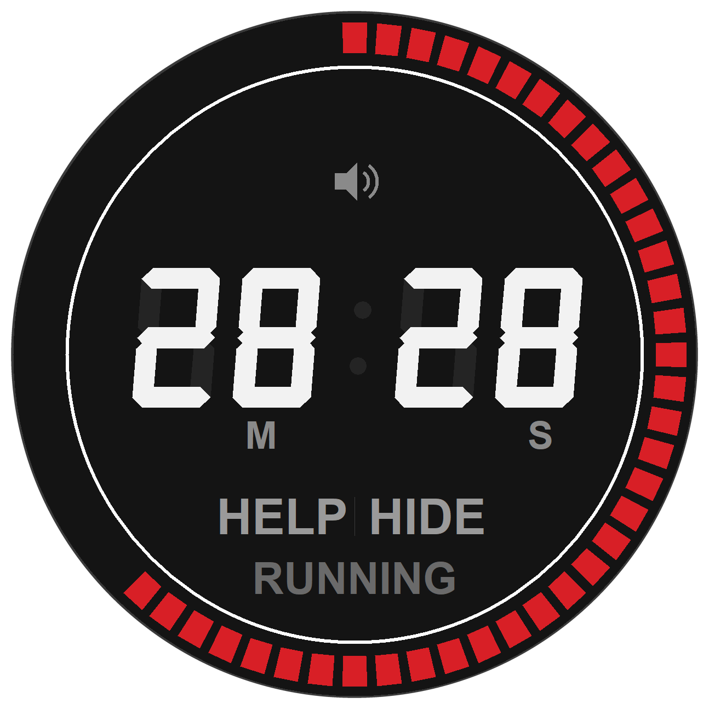
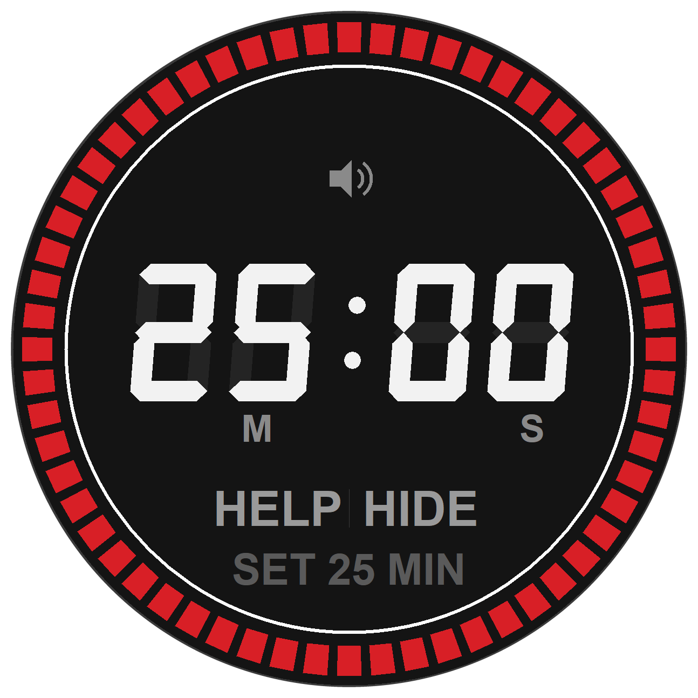
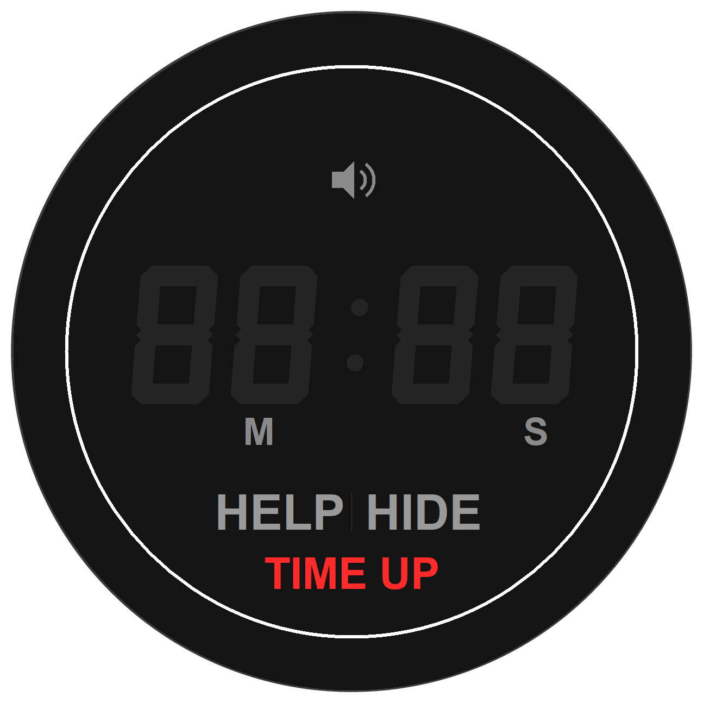
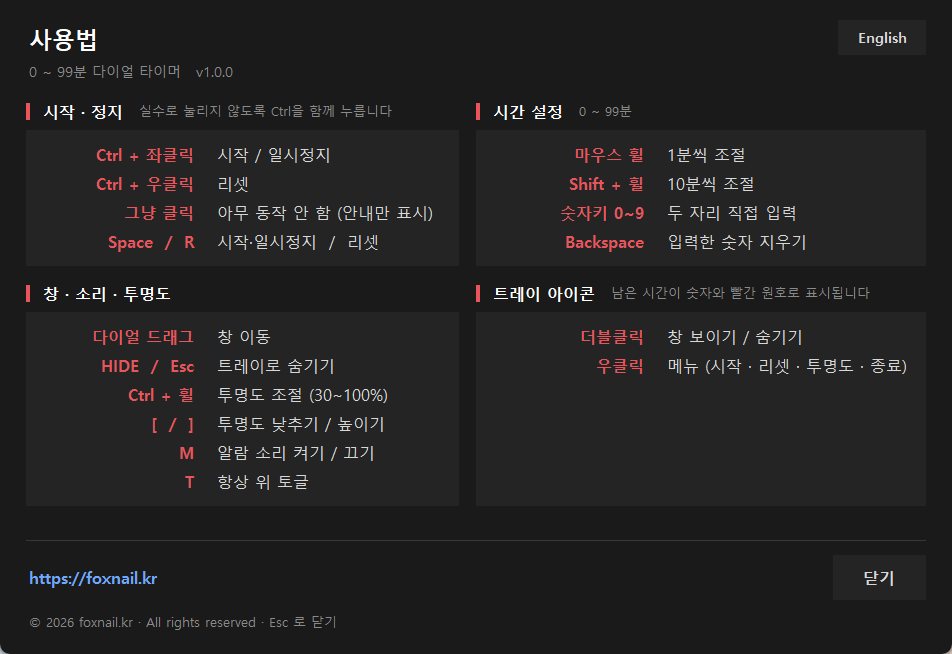
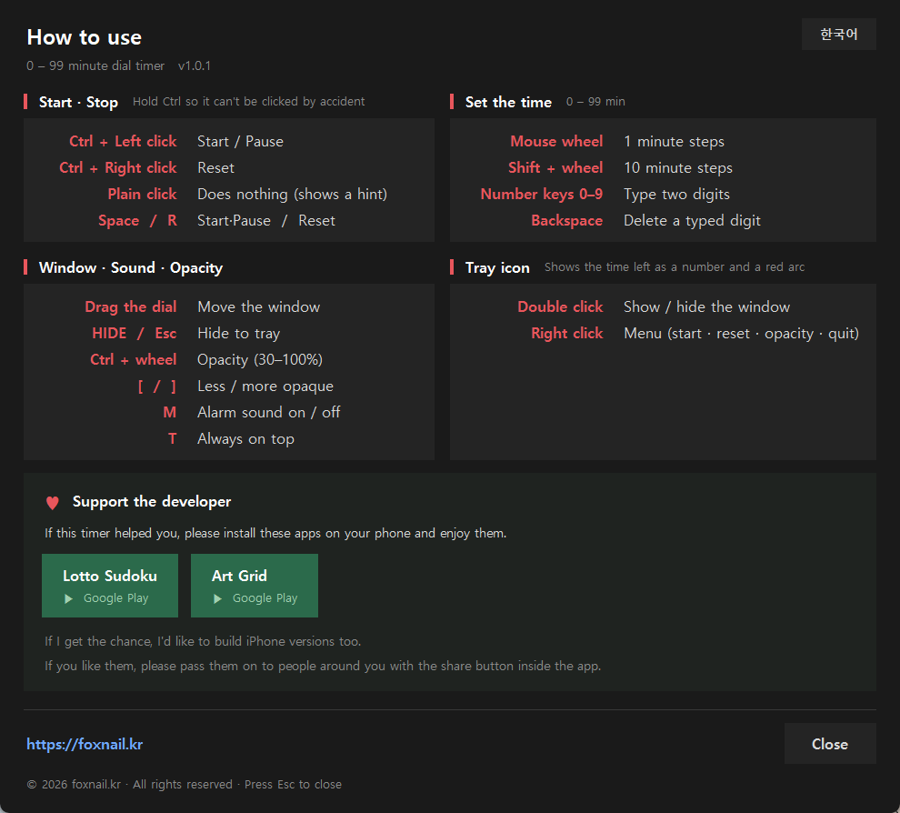

<div align="center">



# Dial Timer

**0 ~ 99분 다이얼 타이머 · Windows 트레이 프로그램**
**A 0–99 minute dial timer that lives in the Windows tray**

실물 주방 타이머의 원형 다이얼을 화면에 옮겼습니다. 남은 시간이 빨간 눈금으로 한눈에 보이고, 평소엔 트레이에 숨어 있습니다.
<br>
*A kitchen-timer dial on your desktop. The time left reads at a glance as red ticks, and it hides in the tray when you don't need it.*

[](https://github.com/farmerkweon/dial-timer/releases/latest)
[](LICENSE)





</div>

---

## 특징 / Features

| 한국어 | English |
|---|---|
| **원형 다이얼** — 남은 비율만큼 눈금 60개가 12시부터 시계방향으로 채워집니다 | **Circular dial** — 60 ticks fill clockwise from 12 o'clock in proportion to the time left |
| **7세그먼트 LCD** — 꺼진 세그먼트까지 비치는 실제 LCD 질감 | **Seven-segment LCD** — unlit segments stay faintly visible, like real hardware |
| **오작동 방지** — 시작·정지·리셋은 `Ctrl`을 함께 눌러야 동작 | **Misclick-proof** — start, pause and reset all require `Ctrl` |
| **트레이 상주** — 아이콘에 남은 시간이 숫자와 빨간 원호로 표시 | **Lives in the tray** — the icon shows the time left as a number and a red arc |
| **투명도 조절** — 30~100%, 작업 화면 위에 겹쳐 사용 | **Adjustable opacity** — 30–100%, so it can sit on top of your work |
| **테두리 없는 원형 창** — 사각 프레임 없이 다이얼만 | **Frameless round window** — the dial and nothing else |
| **한/영 도움말** — 시스템 언어로 자동 선택, 버튼으로 전환 | **Bilingual help** — follows your Windows language, switchable by a button |

### 다운로드 / Download

| 경로 | 링크 |
|---|---|
| **foxnail.kr 직접 / direct** (GitHub이 막힌 망에서도 동작) | **[DialTimer-1.0.2-Setup.exe](https://foxnail.kr/downloads/DialTimer-1.0.2-Setup.exe)** |
| GitHub 릴리즈 / release | [최신 릴리즈 / latest](https://github.com/farmerkweon/dial-timer/releases/latest) |

<div align="center">


</div>

## 설치 / Installation

### 설치 파일 / Installer (권장 / recommended)

1. [foxnail.kr 직접 다운로드](https://foxnail.kr/downloads/DialTimer-1.0.2-Setup.exe) 또는 [GitHub 릴리즈](https://github.com/farmerkweon/dial-timer/releases/latest)에서 `DialTimer-1.0.2-Setup.exe` 를 내려받습니다
   <br>*Get `DialTimer-1.0.2-Setup.exe` [straight from foxnail.kr](https://foxnail.kr/downloads/DialTimer-1.0.2-Setup.exe) (works where GitHub is blocked) or from the [GitHub release](https://github.com/farmerkweon/dial-timer/releases/latest)*
2. 실행하고 안내를 따릅니다. **관리자 권한이 필요 없습니다** — 사용자 폴더에 설치되므로 UAC 창이 뜨지 않습니다
   <br>*Run it and follow the wizard. **No administrator rights needed** — it installs per-user, so there is no UAC prompt*
3. 설치 중 **"Windows 시작할 때 자동 실행"** 을 켜면 로그인할 때 트레이에 자동으로 뜹니다
   <br>*Tick **"Run at Windows startup"** during setup to have it appear in the tray at login*

제거는 **설정 → 앱** 또는 시작 메뉴의 **Dial Timer 제거** 로 합니다. 설정 파일(`%APPDATA%\DialTimer`)도 함께 정리됩니다.
<br>*Uninstall from **Settings → Apps** or the **Dial Timer 제거** shortcut. Your settings in `%APPDATA%\DialTimer` are removed too.*

> 코드 서명이 없어 Windows SmartScreen이 경고할 수 있습니다. **추가 정보 → 실행** 을 누르면 설치됩니다.
> <br>*The installer is unsigned, so SmartScreen may warn you. Choose **More info → Run anyway**.*

### 소스로 실행 / From source

Python 3.9+

```bash
git clone https://github.com/farmerkweon/dial-timer.git
cd dial-timer
pip install pystray pillow
pythonw tray_timer.py
```

`tkinter`는 Python에 기본 포함입니다. / *`tkinter` ships with Python.*

## 사용법 / How to use

오작동 방지를 위해 **시작·정지와 리셋은 `Ctrl`과 함께 클릭**해야 합니다. 그냥 클릭하면 아무 일도 없고 `Ctrl + Click` 안내만 뜹니다.
<br>*So it can't be triggered by accident, **start, pause and reset need `Ctrl` + click**. A plain click does nothing but flash a `Ctrl + Click` hint.*

### 시작 · 정지 / Start · Stop

| 조작 / Action | 기능 | Function |
|---|---|---|
| **Ctrl + 좌클릭** / *left click* | 시작 / 일시정지 | Start / Pause |
| **Ctrl + 우클릭** / *right click* | 리셋 | Reset |
| 그냥 클릭 / *plain click* | 아무 동작 없음 (안내만) | Nothing (shows a hint) |
| `Space` / `R` | 시작·일시정지 / 리셋 | Start·Pause / Reset |

### 시간 설정 / Set the time (0 ~ 99분)

| 조작 / Action | 기능 | Function |
|---|---|---|
| 마우스 휠 / *mouse wheel* | 1분씩 조절 | 1 minute steps |
| `Shift` + 휠 / *wheel* | 10분씩 조절 | 10 minute steps |
| 숫자키 `0`~`9` / *number keys* | 두 자리 직접 입력 | Type two digits |
| `Backspace` | 입력한 숫자 지우기 | Delete a typed digit |

### 창 · 소리 · 투명도 / Window · Sound · Opacity

| 조작 / Action | 기능 | Function |
|---|---|---|
| 다이얼 드래그 / *drag the dial* | 창 이동 | Move the window |
| **HIDE** / `Esc` | 트레이로 숨기기 | Hide to tray |
| **HELP** / `H` | 도움말 팝업 (한/영) | Help popup (KO/EN) |
| **Ctrl + 휠** / *wheel* | 투명도 조절 (30~100%) | Opacity (30–100%) |
| `[` / `]` | 투명도 낮추기 / 높이기 | Less / more opaque |
| `M` | 알람 소리 켜기 / 끄기 | Alarm sound on / off |
| `T` | 항상 위 토글 | Always on top |

### 트레이 아이콘 / Tray icon

| 조작 / Action | 기능 | Function |
|---|---|---|
| 더블클릭 / *double click* | 창 보이기 / 숨기기 | Show / hide the window |
| 우클릭 / *right click* | 메뉴 (시작·리셋·소리·항상 위·투명도·종료) | Menu (start, reset, sound, on top, opacity, quit) |

## 동작 / Behaviour

- 시간이 다 되면 숫자와 눈금이 빨갛게 점멸하고 비프음이 울립니다(최대 60초). 알람 중에는 `Ctrl` 없이 클릭해도 즉시 멈추고 리셋됩니다.
  <br>*When time is up the digits and ticks blink red and it beeps for up to 60 seconds. During the alarm a plain click stops and resets it — no `Ctrl` needed.*
- **알람 중에는 투명도를 무시하고 불투명해집니다** — 30%로 켜 두어도 놓치지 않습니다.
  <br>***The alarm overrides opacity and goes fully opaque***, so you won't miss it even at 30%.*
- 0분에서는 시작되지 않고 `SET TIME` 안내가 뜹니다. / *At 0 minutes it won't start; it shows `SET TIME`.*
- 시간 설정을 바꾸면 항상 정지 상태로 리셋됩니다. / *Changing the time always resets to a stopped state.*
- 창 위치·설정 분·음소거·항상 위·투명도·도움말 언어는 `%APPDATA%\DialTimer\timer_config.json`에 저장됩니다.
  <br>*Window position, minutes, mute, always-on-top, opacity and help language persist in `%APPDATA%\DialTimer\timer_config.json`.*
- 두 번 실행해도 트레이 아이콘은 하나만 뜹니다. / *Launching twice still gives you a single tray icon.*

## 크기 · 눈금 조정 / Sizing

`tray_timer.py` 위쪽 상수 두 개로 조절합니다. / *Two constants near the top of `tray_timer.py`:*

```python
TICK_LENGTH = 11.0   # 빨간 눈금 바 길이        / length of the red ticks
UI_SCALE    = 0.65   # 시계 전체 크기 배율      / overall clock scale
```

눈금이 길어지면 다이얼 지름과 창 크기도 따라 커집니다. 안쪽 원반 + 눈금 + 테두리로 창 크기를 역산하므로 빈 고리가 생기지 않습니다.
<br>*Longer ticks grow the dial and the window with them — the window size is derived from disc + ticks + rim, so no empty ring ever appears.*

## 개발 / Development

UI와 로직을 분리했습니다. `TimerCore`는 tkinter를 전혀 모르는 순수 상태 머신이라 창 없이 테스트할 수 있습니다.
<br>*UI and logic are separate. `TimerCore` is a pure state machine that knows nothing about tkinter, so it tests headlessly.*

| 파일 / File | 설명 / Description |
|---|---|
| `tray_timer.py` | 본체 / the application |
| `test_timer_core.py` | 로직 단위 테스트 30항목 / 30 logic assertions |
| `test_interaction.py` | 입력 통합 테스트 60항목 / 60 input assertions (opens a real window) |
| `build/make_icon.py` | 앱 아이콘 생성 / builds the .ico |
| `build/make_version.py` | exe 버전 리소스 생성 (APP_VERSION에서 읽음) / builds the version resource |
| `build/make_hero.py` | 투명 배경 시계 이미지 생성 / renders the transparent clock images |
| `installer/DialTimer.iss` | Inno Setup 스크립트 / installer script |

```bash
python test_timer_core.py
python test_interaction.py
```

### 배포본 빌드 / Building a release

```bash
python build/make_icon.py
python build/make_version.py
pyinstaller --noconfirm --clean --windowed --name DialTimer ^
    --icon build/dial_timer.ico --version-file build/version_info.txt ^
    --hidden-import pystray._win32 ^
    --distpath build/dist --workpath build/work --specpath build tray_timer.py
ISCC installer/DialTimer.iss
```

## 만든 사람 응원하기 / Support the developer

이 시계가 도움이 되셨다면, 개발자를 위해 아래 앱을 핸드폰에 설치하고 즐겨주세요.
<br>*If this timer helped you, please install these apps on your phone and enjoy them.*

<div align="center">

[](https://play.google.com/store/apps/details?id=com.foxnail.lotto_sudoku)
&nbsp;
[](https://play.google.com/store/apps/details?id=com.artgrid.app.free)

**[로또 스도쿠](https://play.google.com/store/apps/details?id=com.foxnail.lotto_sudoku)** · **[아트 그리드](https://play.google.com/store/apps/details?id=com.artgrid.app.free)**

</div>

여력이 되면 아이폰 사용자를 위해서도 만들어 보겠습니다.
<br>*If I get the chance, I'd like to build iPhone versions too.*

이 앱들이 마음에 드신다면, 앱의 공유 버튼을 이용해 주위 지인들에게도 전해주세요.
<br>*If you like them, please pass them on to people around you with the share button inside the app.*

> 같은 내용이 프로그램 도움말(**HELP**) 맨 아래에도 들어 있습니다.
> <br>*The same section is at the bottom of the in-app help.*

## 라이선스 / License

[MIT](LICENSE) © 2026 [foxnail.kr](https://foxnail.kr)
